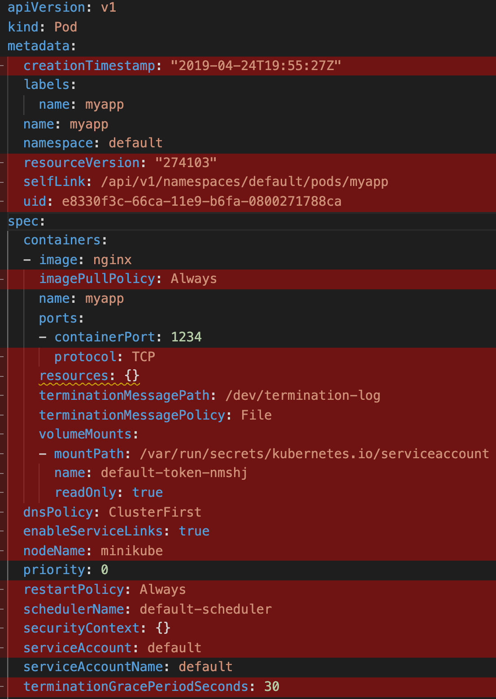
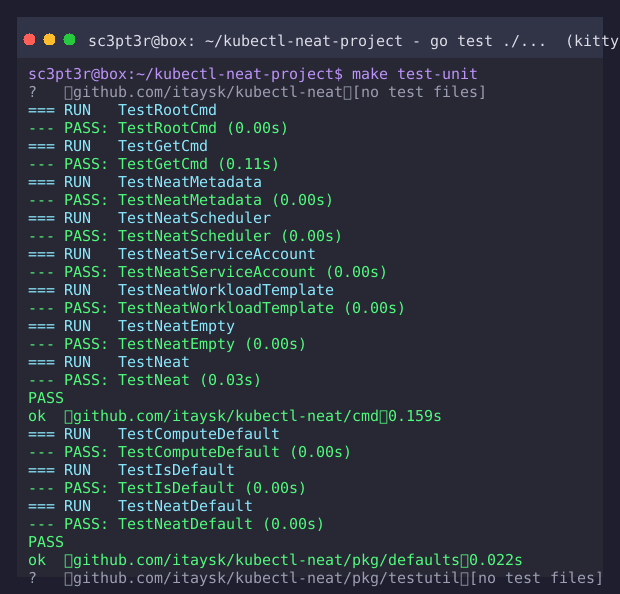

# kubectl-neat

[](https://github.com/vitaltechmyanmar/kubectl-neat/actions/workflows/ci.yml)
[](https://github.com/vitaltechmyanmar/kubectl-neat/actions/workflows/release.yml)
[](https://goreportcard.com/report/github.com/vitaltechmyanmar/kubectl-neat)

> **Maintained fork** of [itaysk/kubectl-neat](https://github.com/itaysk/kubectl-neat).

Remove clutter from Kubernetes manifests to make them more readable.

When Kubernetes stores a resource you created, it injects a lot of information you never
authored — default values, internal metadata, admission-controller and scheduler leftovers.
`kubectl get` output becomes unreadably verbose. `kubectl-neat` cleans it up.

## Demo

Here is a result of a `kubectl get pod -o yaml` for a simple Pod. The lines marked in red are
considered redundant and will be removed from the output by kubectl-neat.



## Test Results



## Features

- Removes `status`, scheduler-assigned `spec.nodeName`, and stale internal metadata
- Removes default values for the `v1` (core), `apps/v1`, and `batch/v1` API groups using
  Kubernetes' own object-model defaulting
- Cleans up admission-controller leftovers: service-account token volumes, system tolerations,
  and RuntimeClass-computed pod overhead
- Handles YAML and JSON, single resources and Kubernetes `List`s

## Installation

```bash
kubectl krew install neat
```

Or download the binary for your platform from the
[releases page](https://github.com/vitaltechmyanmar/kubectl-neat/releases).

Installed as a kubectl plugin, the command is `kubectl neat`; as a standalone executable it is
`kubectl-neat`. All install options are covered in the [setup guide](docs/setup.md).

Verify the installation:

```bash
kubectl neat version
```

## Quick start

```bash
# pipe a kubectl result
kubectl get pod mypod -o yaml | kubectl neat

# read from a file or stdin
kubectl neat -f ./my-pod.yaml
kubectl neat -f - < ./my-pod.json

# run kubectl get and neat in a single command (default output is JSON)
kubectl neat get -- pod mypod -o yaml
kubectl neat get -- svc -n default myservice --output json
```

The output format defaults to the input format (`yaml`/`json`); override it with `-o yaml|json`.
See the [usage guide](docs/usage.md) for the full command reference.

## Documentation

| Topic | Link |
| --- | --- |
| Setup | [docs/setup.md](docs/setup.md) |
| Usage | [docs/usage.md](docs/usage.md) |
| Testing | [docs/testing.md](docs/testing.md) |
| Release & tagging | [docs/release.md](docs/release.md) |
| Architecture | [docs/architecture.md](docs/architecture.md) |
| Changelog | [CHANGELOG.md](CHANGELOG.md) |

## How it works

kubectl-neat always removes:

- `status` and other runtime information
- scheduler-assigned `spec.nodeName`
- Pod service-account token volumes (`default-token-*`) and the deprecated `spec.serviceAccount` field
- system-added tolerations (`DefaultTolerationSeconds` and node-condition tolerations)
- RuntimeClass-computed pod overhead (`spec.overhead`)
- `creationTimestamp` in workload pod templates (`spec.template.metadata`)
- the `kubectl.kubernetes.io/last-applied-configuration` annotation
- empty arrays and objects

On top of that, it removes default values inserted by Kubernetes' object model and handles
common mutating controllers. The full design is described in
[docs/architecture.md](docs/architecture.md).

## Contributing

See [CONTRIBUTING.md](CONTRIBUTING.md).

## Security

See [SECURITY.md](SECURITY.md).

## License

[Apache-2.0](LICENSE)